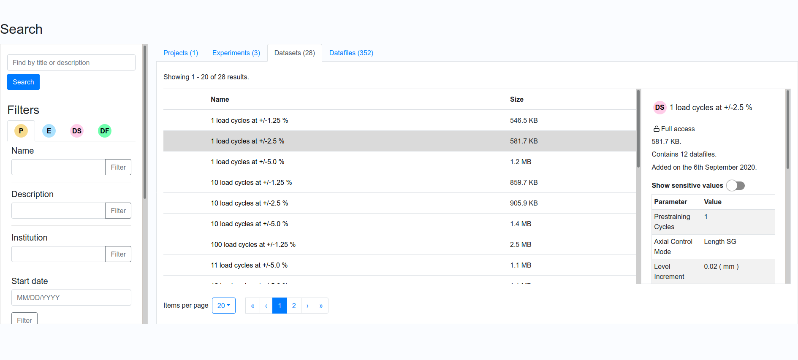

Documentation about the frontend code for the MyTardis search app. See the [search app backend README](../../../tardis/apps/search/README.md) for general overview.
<!-- PROJECT LOGO -->

 

  <h3 align="center">UoA MyTardis Search frontend</h3>
  

    React and Redux-based frontend. Search through and preview MyTardis objects by keywords and metadata criteria.
	<!--
     
    <a href="https://github.com/github_username/repo_name"><strong>Explore the docs »</strong></a>
     -->
     
    <a href="https://github.com/UoA-eResearch/mytardis/">Report Bug and Request Features</a>
  

<!-- TABLE OF CONTENTS -->
## Table of Contents

- [Table of Contents](#table-of-contents)
- [About the Project](#about-the-project)
  - [Built With](#built-with)
- [Usage](#usage)
- [Roadmap](#roadmap)
- [Contact](#contact)

## About the Project
The search frontend aims to add the ability to search by metadata fields to MyTardis. This includes searching by attributes of the objects (e.g. title, creation date), as well as by schemas and schema parameters associated with the objects. Filters can be The interface has features like sorting and pagination to make finding things easier. Searches can be saved by copying the URL.
### Built With
- React
- Redux Toolkit - client-side state management
- Storybook - component development
- Jest and React Testing Library - for writing functional and snapshot tests
- react-bootstrap and react-icon - styling
- Various component libraries

## Usage
To set up a local development environment, clone this repository and set up the MyTardis environment and its dependencies. Run the MyTardis Django app using `python manage.py runserver`. Then, in a terminal, change to this directory, then:

1. Run `npm install` - This installs all dependencies.
2. Run `npm run dev` - This sets up Webpack to compile the web app and watch for file changes.
3. In a separate terminal, run `npm run storybook` - this allows you to see and develop components of the app with mock data, and test for edge cases.
4. In a separate terminal, run `npm run test-react -- --watch` - this runs frontend tests and watches for file changes. 
5. Visit [http://localhost:8000/search](http://localhost:8000/search) or where MyTardis is hosted.
## Roadmap
As of February 2021:
- Bulk download cart feature
- Pushing data to high performance computing platforms
- Support for checkbox filters
- Security testing
- Updating look and feel of the app

## Contact
Contact c.seal@auckland.ac.nz for more information about the University of Auckland's project to adapt MyTardis for instrument data storage use.