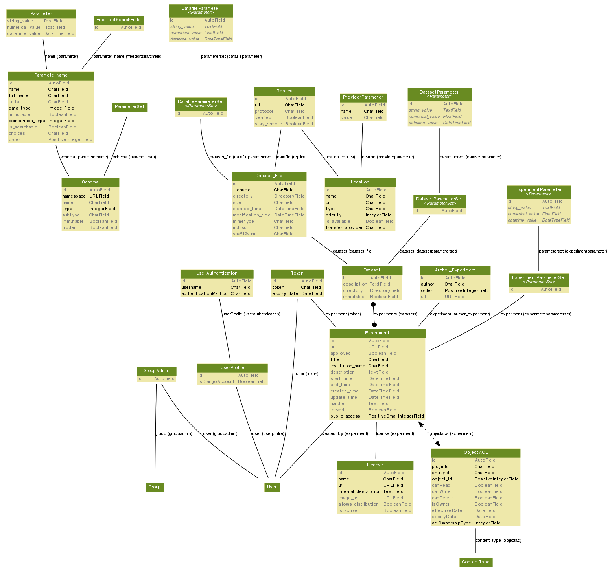

.. _architecture:

============
Architecture
============

This page describes the architecture of MyTARDIS.

MyTARDIS is built on the Django web framework, which itself is
built on Python, thus MyTARDIS follows the architectural model
of Django.

Component Architecture
----------------------

The diagram below shows the major components of a typical
MyTARDIS installation.

.. image:: images/TardisComponentArchitecture.png
   :width: 800px

Web Server
  MyTARDIS is typically deployed with the standard `Apache Http <http://projects.apache.org/projects/http_server.html>`_ + `WSGI <http://code.google.com/p/modwsgi/>`_ + `Django <http://www.djangoproject.com/>`_ + `Python <http://docs.python.org/>`_ stack.
RDBMS
  Any of the Django supported databases may be used, typically Postgres.
Data Archive
  Normal file server, e.g. NFS, SAMBA.
Browser
  Typically Firefox
Ingestion
  Ingestion is normally site specific.

Functional Architecture
-----------------------

MyTARDIS follows the standard Django architecture, as shown below [JCDA]_:

.. image:: images/DjangoArchitecture-JeffCroft.png

The major functional modules in MyTARDIS are:

Auth
  Authentication and Authorisation.

Download
  Data download functionality.

Filters
  Processing of metadata as data is uploaded, e.g. extract EXIF metadata from JPEG files.

Management
  Additional commands for the Django CLI.  The backup utility is implemented as a Django command.

Migrations
  South database migration code.

Publish
  RIF-CS metadata publication.

Information on the individual modules is available from the :ref:`modindex`.

.. [JCDA] Thanks to `Jeff Croft <http://www.flickr.com/photos/jcroft/432038560/sizes/o/in/photostream/>`_ for the diagram.

Scalability Model
-----------------

At the component / module level, performance and Scalability within MyTARDIS is achieved by:

* Allowing long lived or compute intensive operations to be hosted on separate machines from the main web server.

  * E.g. by running multiple web servers and sending long lived operations, such as ingestion, to a server reserved for such operations.

* Performance and Scalability of the database is achieved by a combination of 1) optimising the SQL requests issued by MyTARDIS, and 2) database specific scalability, please refer to the appropriate database documentation.

* Performance and Scalability of the web server is provided through the normal mechanisms for apache / wsgi hosted python applications, e,g,:

  * Increasing individual Server capability

    * Individual Server performance / utilization may be managed by controlling the number of python (django) processes active at any one time.

  * Deploying multiple web servers

    * Multiple web servers may be deployed using standard mechanisms, e.g. hardware load balancers.  State (session) information is distributed using Django's standard session model.

* The Data Archive is a normal file system, e.g. NFS, SAMBA, etc., with performance and scalability dependent on the implementation and deployment.

* Extraction and formatting of metadata for ingestion is up to the client and may be distributed across any number of machines.

SQL Scalability Notes
^^^^^^^^^^^^^^^^^^^^^

The datafileparameter table is expected to be the single largest table by an order of magnitude, in the hundreds of millions of records (at the Australian Synchrotron).

For Postgres, this will probably be addressed by table partioning.  In this case using a date field to partition is often recommended.  Dates may be introduced as part of the support for anotations, raw data, versioned data and derived data.

Persistance and Data Architecture
---------------------------------

An introduction to how Tardis models Experiments, Datasets and Datafiles is provided in the :doc:`overview`.

Django provides an Object-Relational-Model that maps Django Models to the underlying relational database.  The models as defined in Django are:

An additional model diagram including the base Django models is also available: :doc:`ref/models-graphviz-all`.

The underlying SQL schema generated by Django is not normally referenced directly as it is managed through Django's ORM, however a version of the schema is available: :doc:`ref/sql-graphviz`.

Security Model
--------------

Authentication
^^^^^^^^^^^^^^

Access to data catalogued by MyTARDIS may be either public, i.e. anonymous access allowed, or private, requiring authentication.  The Authentication Framework is documented in :ref:`ref-authframework`.

Authorisation
^^^^^^^^^^^^^

MyTARDIS includes an extensible authorisation engine, documented in :ref:`ref-authframework`.

Web Server Security
^^^^^^^^^^^^^^^^^^^

The Django framework provides security against:

* `Cross Site Request Forgery protection <http://docs.djangoproject.com/en/1.2/ref/contrib/csrf/>`_
* `SQL Injection Attacks <http://docs.djangoproject.com/en/1.2/topics/db/sql/>`_

Class Diagram
-------------

Unless the application has a very rich business model (which MyTARDIS does not), a Class diagram doesn't convey much information in Django applications (it ends up being a flat list of classes).  To understand the context in which the MyTARDIS classes are created, please refer to the Django documentation, http://docs.djangoproject.com/ on the responsibilities of models, views, managers and templates.
