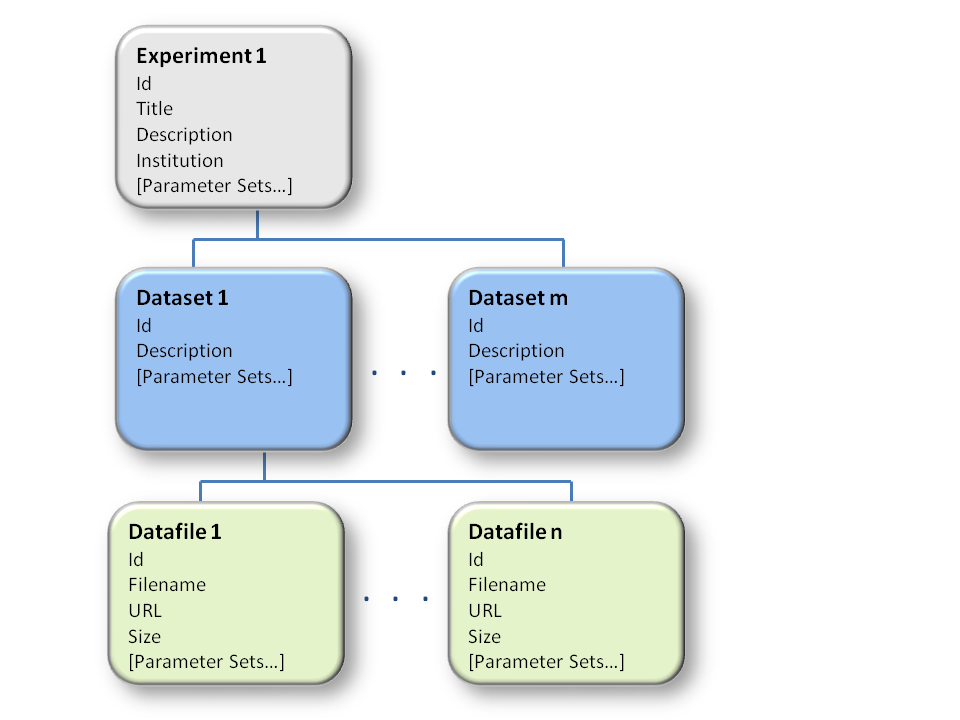

.. _overview:

========
Overview
========

At the simplest level, the experimental data is simply a collection of files (Datafiles), which are grouped in to Datasets, which are grouped in to Experiments:

(Please note that the schema is only partially shown in the diagram above)

At each level, Experiment, Dataset and Datafile, administrator defined parameters may be added, grouped in to Parameter Sets.

Tardis doesn’t impose any interpretation on what is considered an Experiment or Dataset.   Examples of how datasets may be grouped are: by sample, by instrument settings, or as a time sequence, e.g. artificially aging a material and investigating the effects.

