==========
User Guide
==========

These screenshots refer to an older version. While the workflow has remained
largely the same, the look and feel is slightly different.

Browsing & Downloading Data
===========================

1.  Click 'Log In'.

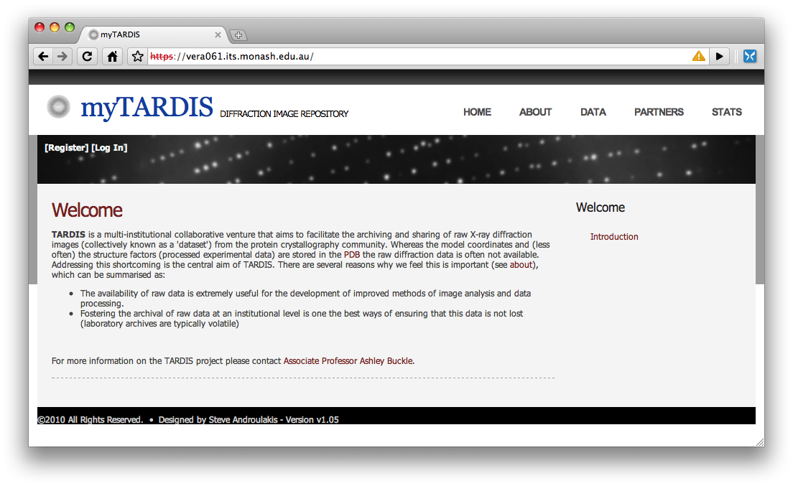

2.  Enter your username and password. **NOTE:** Usually one is able to
    use their institutional username and password combination.

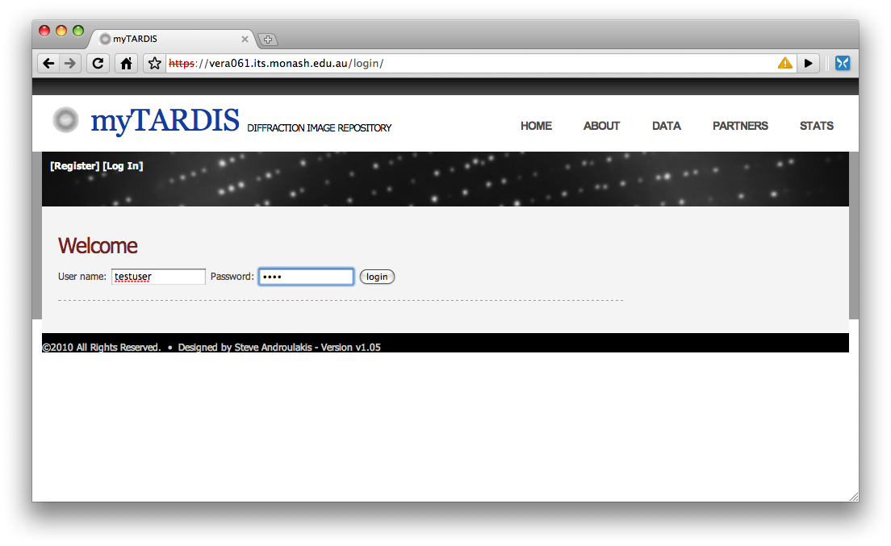

3.  Click 'Data' on the top right menu.

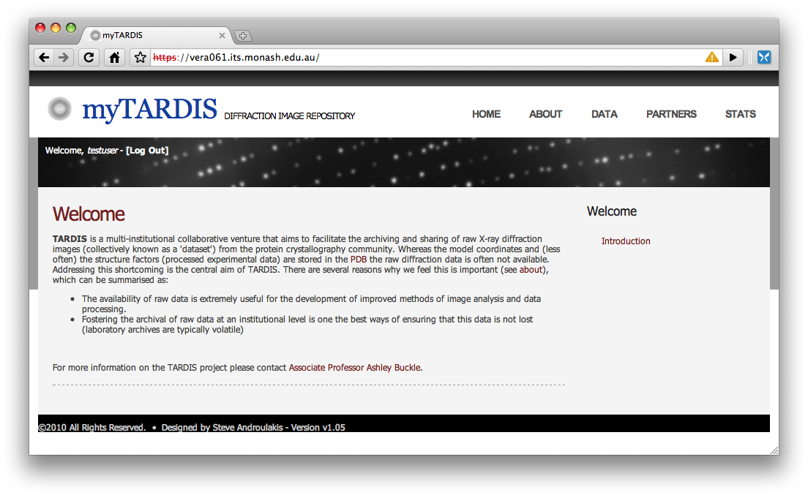

4.  A list of experiments the user has access to is listed. Click the
    title of an experiment to view its information.

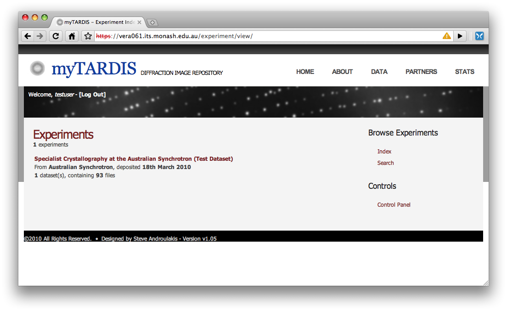

5.  The 'Description' view shows basic information about the experiment
    such as Authors, Title and the total dataset size.

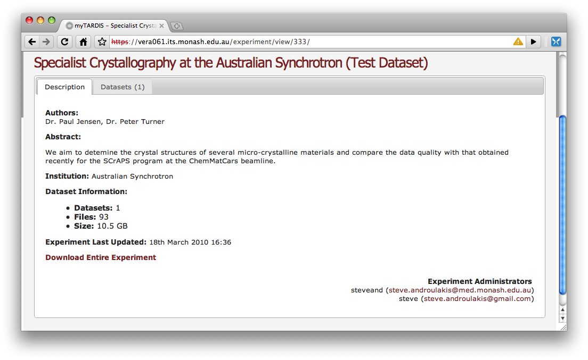

6.  Click the 'Datasets' tab to view all datasets contained within an
    experiment.

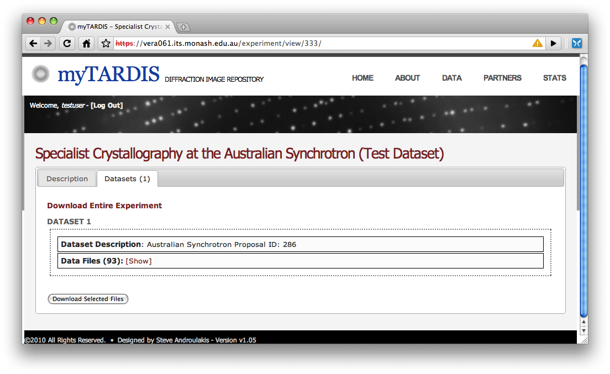

7.  Download all experiment data by clicking 'Download Entire
    Experiment', or click 'Show' to view individual file information.

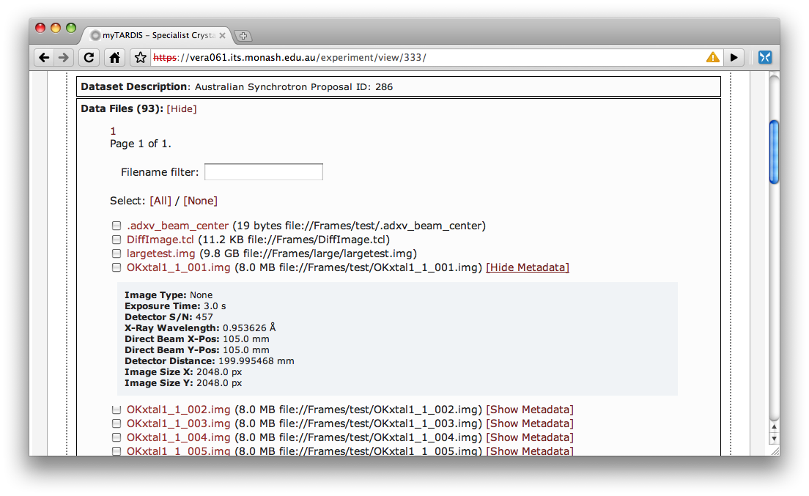

8.  Files with special dataset metadata have Show Metadata next to them.
    Click on this link to view associated metadata.
9.  Click on the red filename link to download individual files.

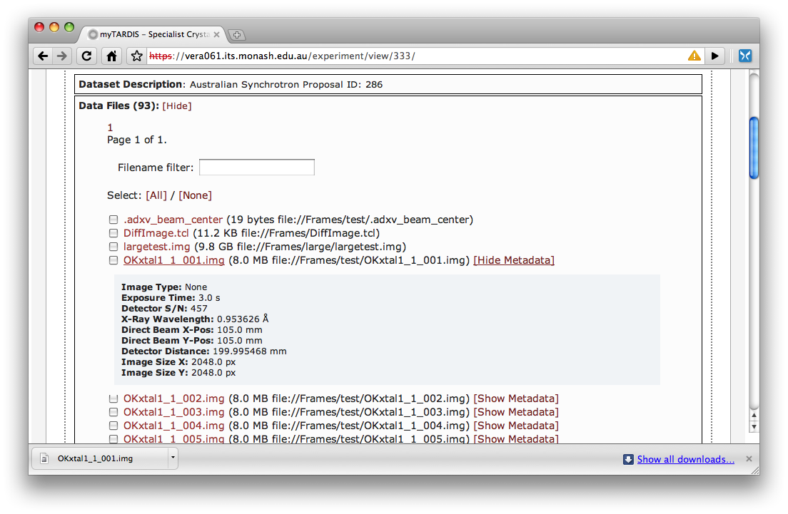

10. Click on the checkboxes next to files and then the 'Download
    Selected Files' button to download a combination of files.

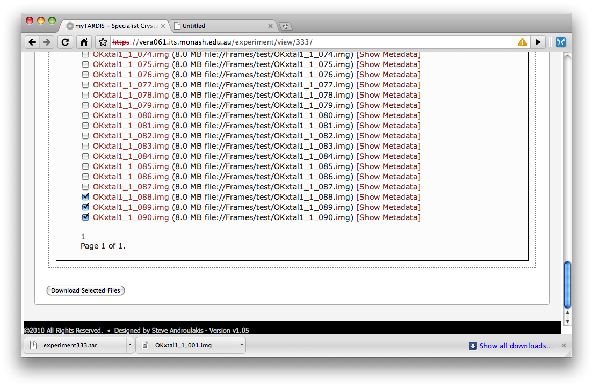

Granting Experiment Access
==========================

1.  Click 'Log In'.

2.  Enter your username and password. **NOTE:** Usually one is able to
    use their institutional username and password combination.

3.  Click 'Data' on the top right menu.

4.  Under the 'Controls' menu on the right, click Control Panel
5.  To control user access to individual experiments, click Show under
    an experiment.

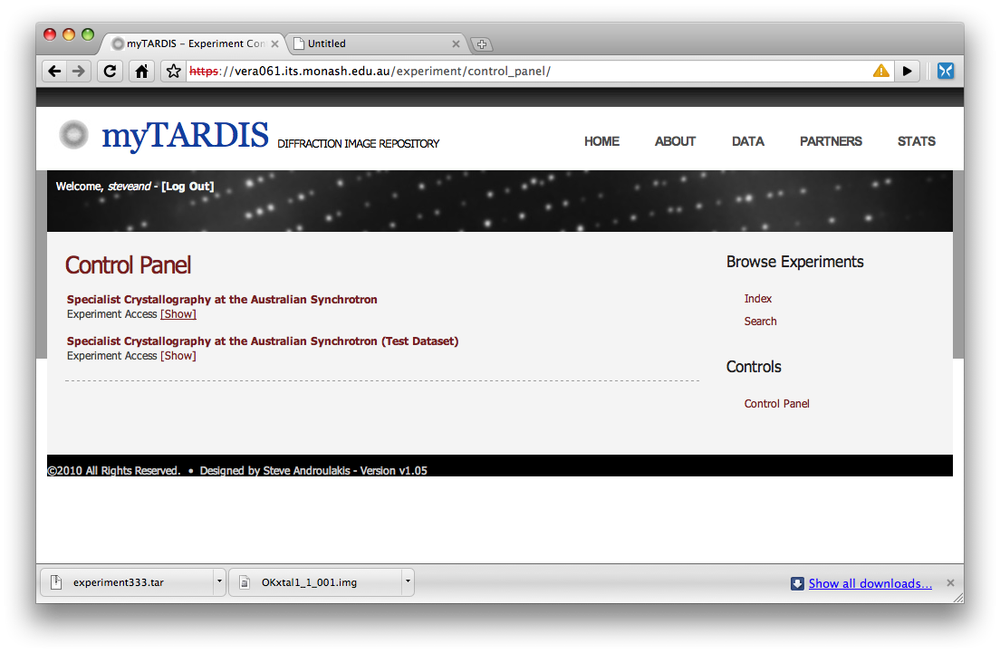

6.  A list of users with access appears. To remove a user, click x

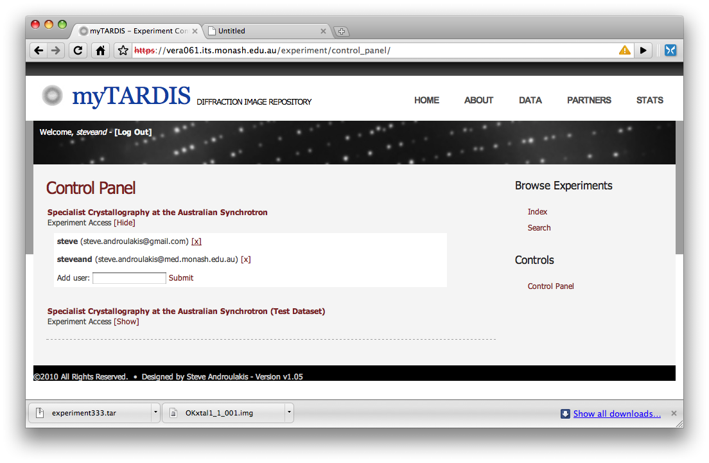

7.  To add a user, start typing their name in the Add User box. Click
    submit when done.

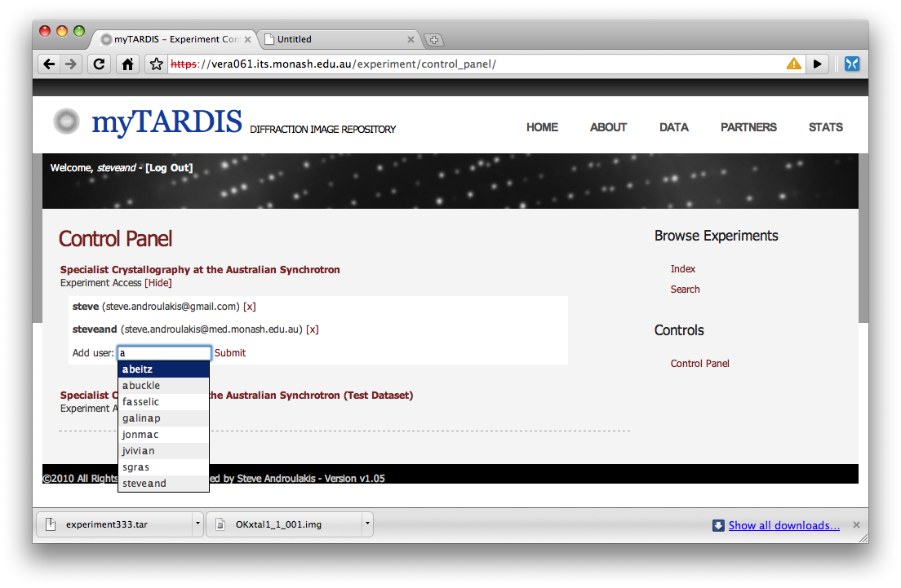

**NOTE:** Those using their insitution's account (authcate, etc) need to
login first before others can give them access to experiments.

**NOTE:** Users granted access to an experiment can't grant other users
access.

See also:
 * :doc:`searching`
 * :doc:`tabs`
