======
Basics
======

.. _org_data:

Organising Data
---------------

Data Structure Overview
^^^^^^^^^^^^^^^^^^^^^^^
Data in MyTardis is organised into a uniform hierarchy, which includes Experiments, Datasets and Data Files. Experiments are at the top of the hierarchy and can contain multiple Datasets. Similarly, Datasets can contain multiple Data Files. The hierarchy can be thought of like a directory structure on a typical PC (Fig. 1) in which a the Experiment directory contains multiple Dataset directories, which in turn contain multiple Data Files.

.. figure:: ../images/userguide/data_hierarchy.png
    :width: 250px
    :align: center

    Fig. 1. Data hierarchy in MyTardis

Creating Experiments
^^^^^^^^^^^^^^^^^^^^

1. Navigate to the **My Data** page.
#. Click on the **Create** button to the right of the page.

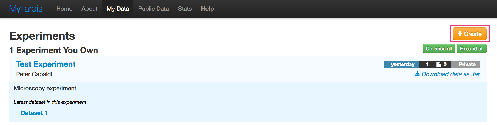

3. Fill in the 'Create Experiment' form. Requires at least a Title and one author.

.. image:: ../images/userguide/create_experiment.png

4. Click **Save**.

Adding Datasets
^^^^^^^^^^^^^^^^^
Datasets always have at least one parent Experiment. To add a dataset to an
Experiment:

1. Navigate to the Experiment page into which you would like to add a dataset.
#. Click the **+ Add New** button to the right of the page.

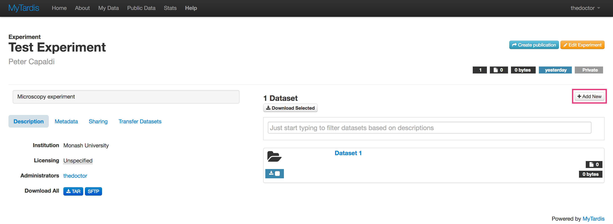

3. Fill in the 'Add new dataset' form. Note: The 'Description' field is
   actually the name of the dataset.

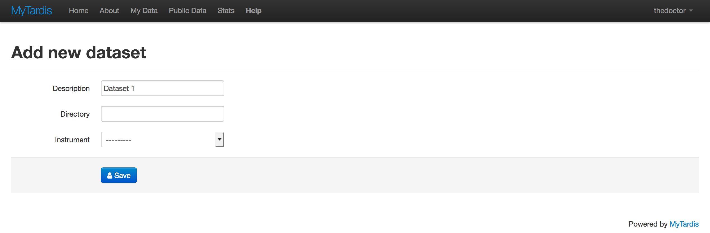

4. Click **Save**.

Adding Data Files
^^^^^^^^^^^^^^^^^
Data Files can be added to a particular Dataset from the Dataset page.

1. Navigate to the Dataset into which you want to add new files.
#. Click the green **Add files...** button to the right of the page.

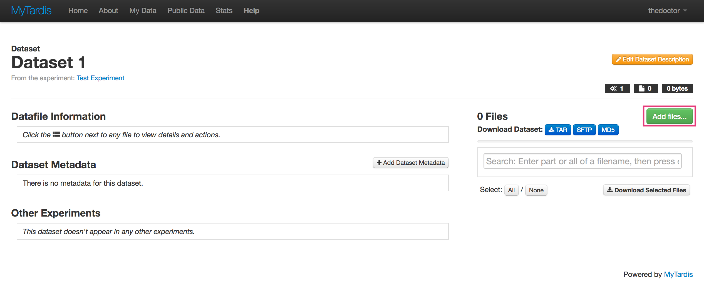

3. Select the files you want to add from the file selector dialog and Click
   **Open**. You can add multiple files by holding the "Shift" or "Ctrl" keys to select multiple files in the dialog.

Accessing Data
--------------

Download a Data File
^^^^^^^^^^^^^^^^^^^^
Individual Data Files can be downloaded as follows:

1. Navigate to the Dataset containing the Data File you want to download.
#. Click the **Download** button on the Data File you want to download.

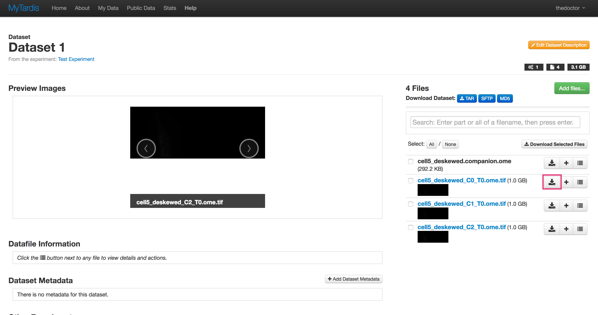

Download a Dataset
^^^^^^^^^^^^^^^^^^
Entire Datasets can be downloaded as a tar archive.

1. Navigate to the Dataset you want to download.
#. Click the **tar** button to the right of the page.

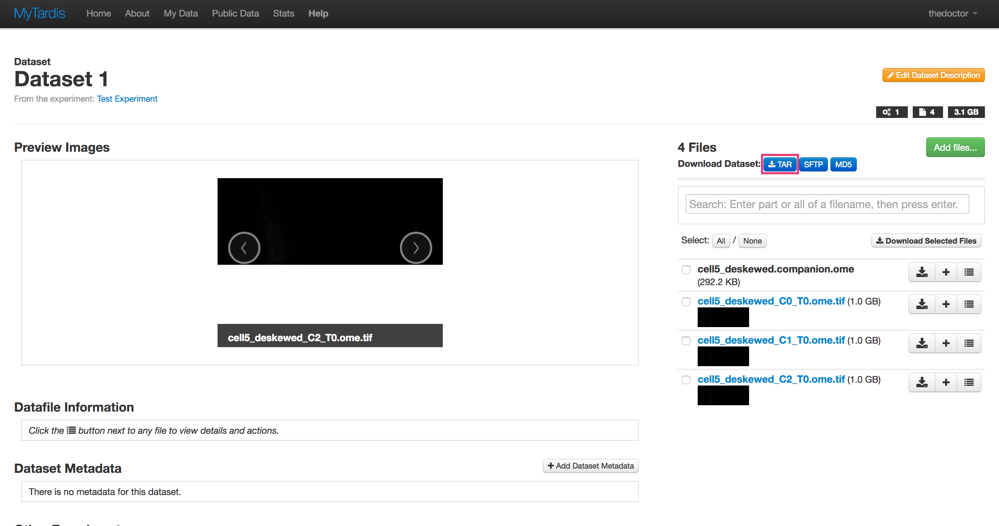

Note: `tar` is an archive format like `zip` that may not be familiar to Windows users and
a default Windows installation may not have the appropriate software to
expand `tar` archives. We suggest that users install `7-zip`_ to expand `tar` archives from MyTardis.

.. _7-zip: http://www.7-zip.org/

Download an Experiment
^^^^^^^^^^^^^^^^^^^^^^
Entire Experiments can be downloaded as a tar archive.

1. Navigate to the Experiment you want to download.
#. Click the **tar** button under the 'Description' section of the page.

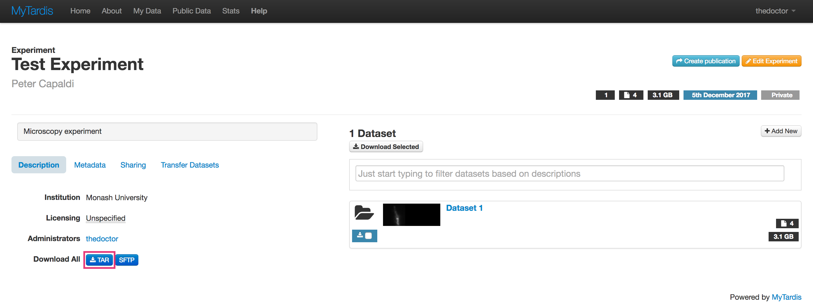

Note: `tar` is an archive format like `zip` that may not be familiar to Windows users and
a default Windows installation may not have the appropriate software to
expand `tar` archives. We suggest that users install `7-zip`_ to expand `tar` archives from MyTardis.

Sharing and Publishing Data
---------------------------
MyTardis provides 3 primary mechanisms for sharing your data:

* Sharing with another MyTardis user.
* Sharing via a temporary (obfuscated) link.
* Making data public.

Data sharing is done at the Experiment level and you can find the options to share an Experiment
under the **Sharing** tab on the left side of an Experiment page.

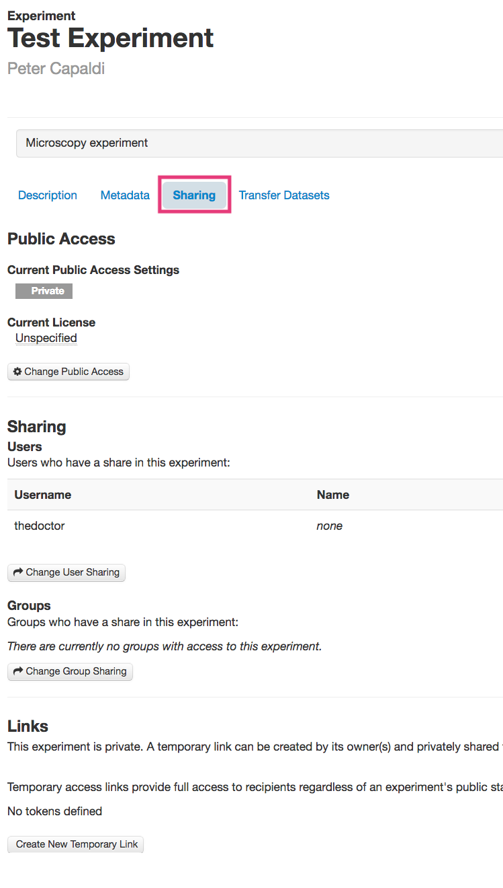

Sharing Data with Another MyTardis User
^^^^^^^^^^^^^^^^^^^^^^^^^^^^^^^^^^^^^^^
To share an Experiment with another MyTardis user:

1. Navigate to the Experiment you want to share.
#. Click on the **Sharing** tab on the left side of the page.
#. Click the **Change User Sharing** button.

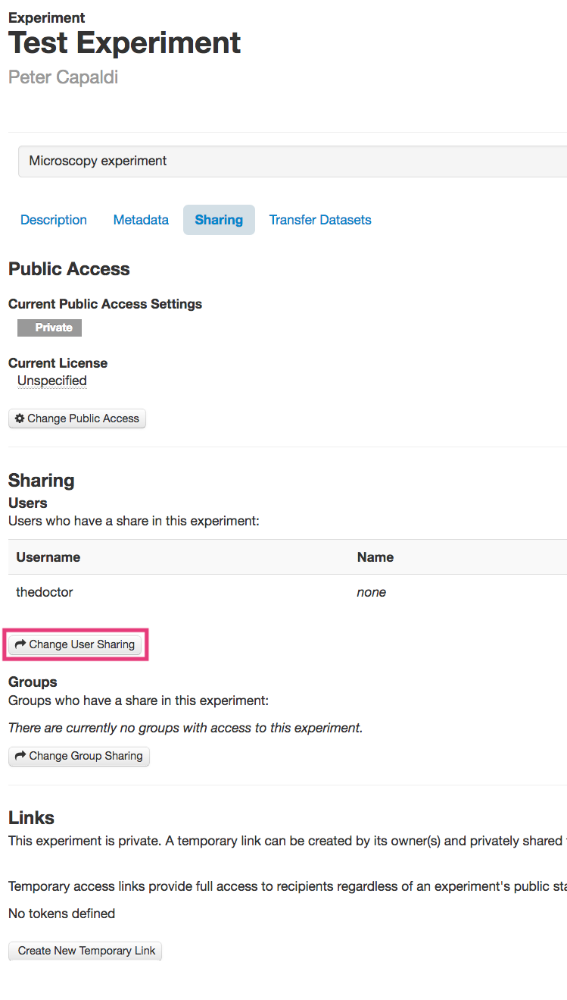

4. Enter the **Username** of the user with which you want to share the data.

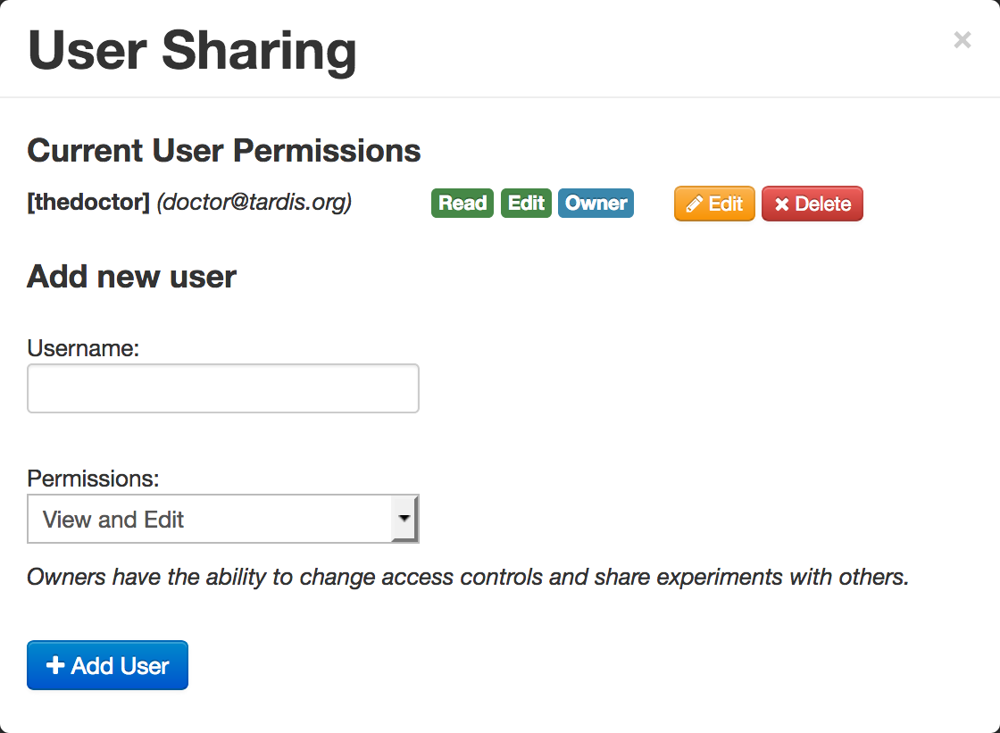

Note: Entering the users name or email address with activate autocomplete, \
   which helps to find the username of the user.

5. Select the permissions you'd like to give the user from the **Permissions** dropdown.
#. Click the **+Add User** button.
#. You should now see a new entry under the **Current User Permissions**
   section showing the user you've shared the Experiment with and the
   permissions you've given them.

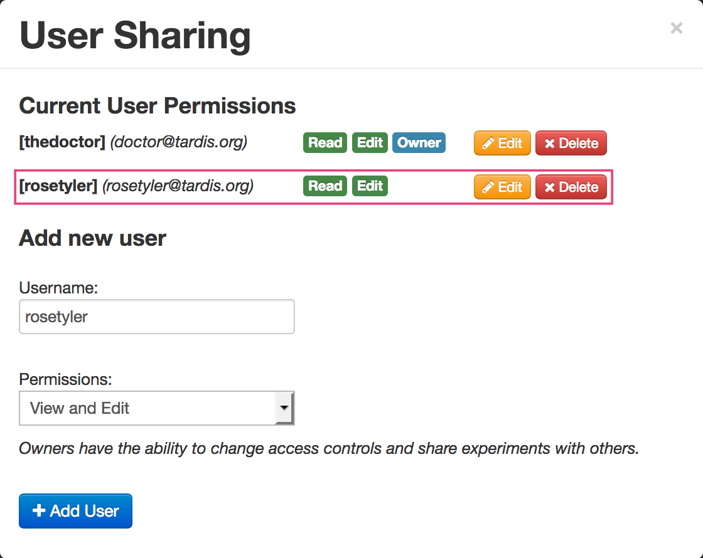

Sharing Data via a Temporary Link
^^^^^^^^^^^^^^^^^^^^^^^^^^^^^^^^^
You can also share Data in an Experiment via a temporary (obfuscated) link.
Temporary links expire after 1 month or can be deleted manually. Note:
temporary links are not protected (i.e., anybody with the link can access the data);
however, they are obfuscated and are thus difficult to find without prior
knowledge of the link.

To share an Experiment via a temporary link:

1. Navigate to the Experiment you want to share.
#. Click on the **Sharing** tab on the left of the page.
#. Click the **Create New Temporary Link** button in the links section.

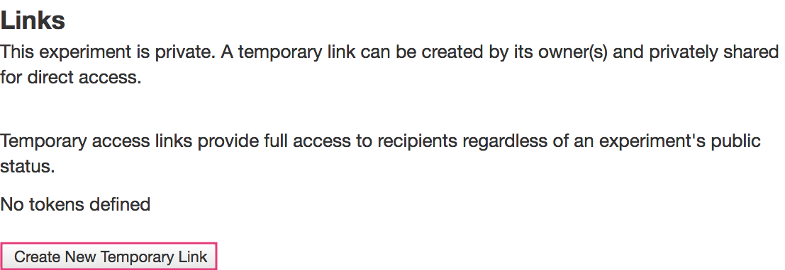

4. You should now see a new entry in the **Links** section. The new entry will
   provide links to both the Experiment page and a direct download link. These
   can be copied to the clipboard using the relevant buttons. These can then be
   shared with collaborators using email etc.

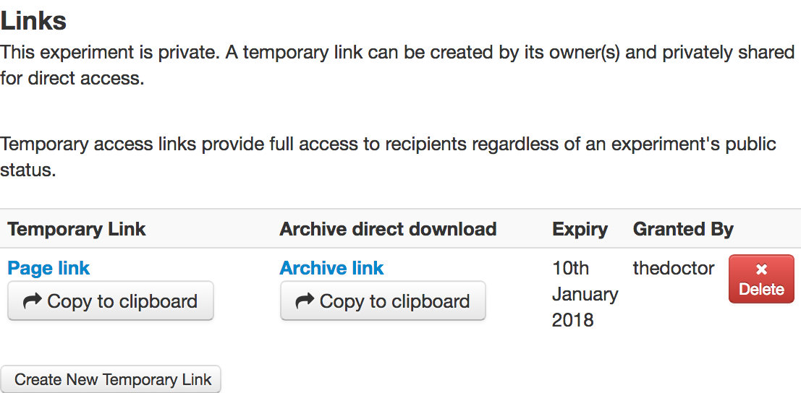

Publishing Data
^^^^^^^^^^^^^^^
Access to an Experiment in MyTardis is set to "private" by default and no
license is attached to the data; however, MyTardis allows data from an
Experiment to be made publicly available with an appropriate license. To make
an Experiment publicly available:

1. Navigate to the Experiment you wish to publish and activate the **Sharing**
   tab to the left of the page.
#. Click the **Change Public Access** button. This will activate the Public
   Access dialog and display the current status of the data.
#. Select **Public** in the "Public access" dropdown menu.
#. Select an appropriate license from the list of licenses presented. In the
   following screenshot, a "Creative Commons Attribution" license is selected;
   however, your choices may be different as licenses are configured by
   your service provider.

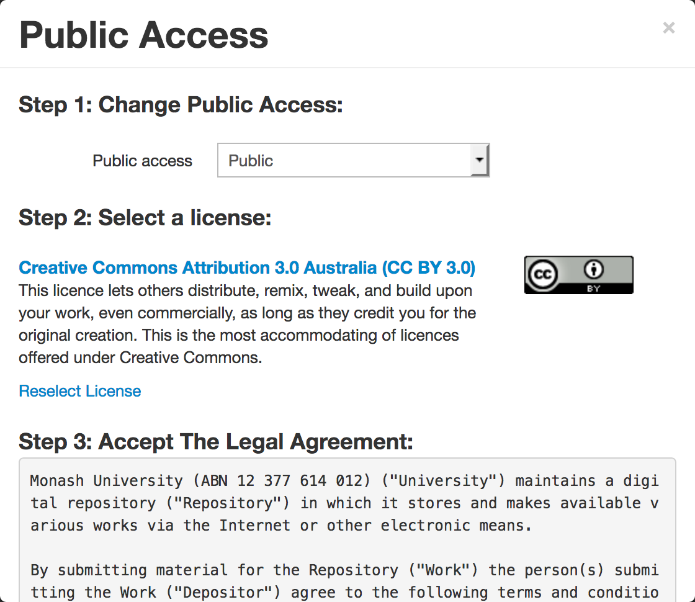

5. Agree to the "Terms of Publishing" of your service provider.
#. Click **Confirm**

