####################
Publication Workflow
####################

***********
Basic Usage
***********

Listing Existing Publications and Drafts
========================================
Click on "My Publications" in the menu bar to see existing publications and drafts which you have access to:

.. image:: ../images/pub-workflow/my-publications-draft-saved.png
   :width: 90%

Creating a Draft Publication
============================
From the "My Publications" page, click "Create publication" to begin a draft publication:

The publication form should appear, showing whatever introductory text has
been configured by your MyTardis administrator, using the
``PUBLICATION_INTRODUCTION`` setting in ``tardis/settings.py``:

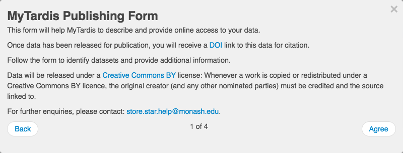

After acknowledging the introductory text, you can begin selecting datasets
to include in your publication:

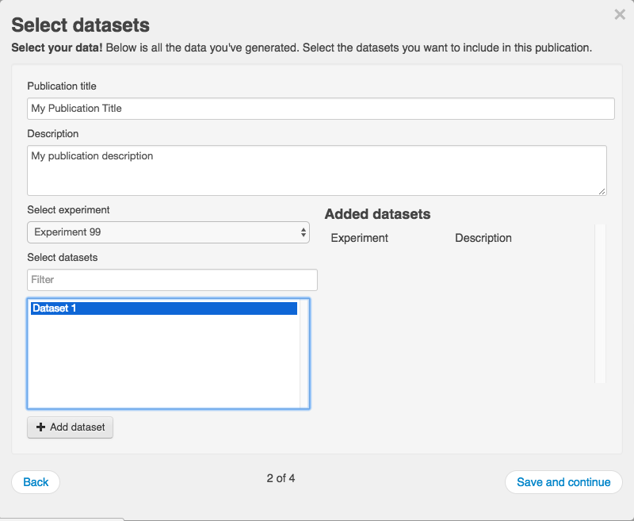

Selected datasets appear on the right:

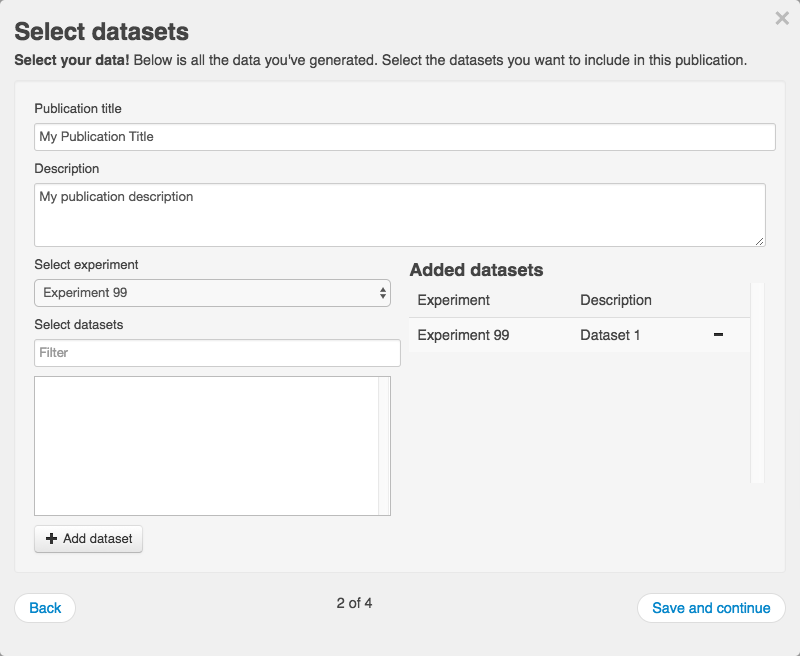

You can then describe each included dataset (beyond what is already in the
dataset's description field):

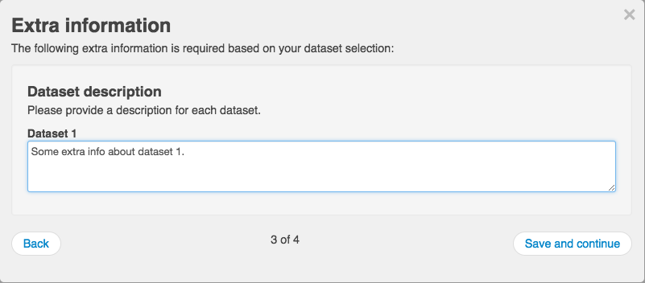

The final page allows you to specify the authors, license, acknowledgements and
release date.  **The last page of the form will be split into two pages in the
next version of the publication form.**

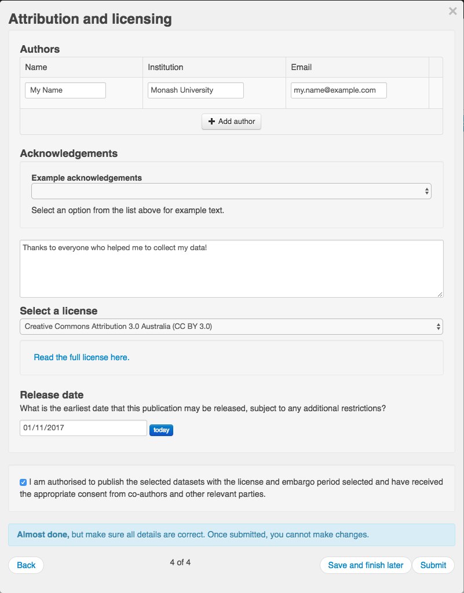

After clicking "Save and finish Later", you can see the publication in the Drafts
section of the "My Publications" page:

.. image:: ../images/pub-workflow/my-publications-draft-saved.png
   :width: 90%

Resuming a Draft Publication
============================
The "Resume draft" button below opens the publication form, allowing you to make further changes:

.. image:: ../images/pub-workflow/my-publications-draft-saved.png
   :width: 90%

When resuming a draft, you will be taken straight to the second page of the publication form below,
skipping the introductory text:

Deleting a Draft Publication
============================
The "Delete draft" button below allowd you to delete a draft publication:

.. image:: ../images/pub-workflow/my-publications-draft-saved.png
   :width: 90%

You will be asked to confirm that you really want to delete the draft publication:

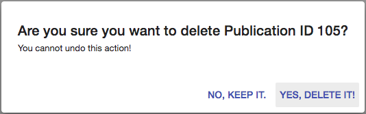

Minting a DOI (Digital Object Identifier)
=========================================
The "Mint DOI" button below allowd you to mint a DOI (Digital Object Identifier):

.. image:: ../images/pub-workflow/my-publications-draft-saved.png
   :width: 90%

You will be asked to confirm that you really want to mint a DOI:

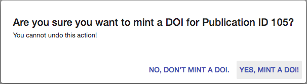

Sharing a Draft Publication
============================
The "Share" button below opens temporary links dialog, allowing you grant short-term access (3 months)
to the draft publication via a temporary URL:

.. image:: ../images/pub-workflow/my-publications-draft-saved.png
   :width: 90%

The first time you click Share, you won't have any tokens for granting temporary access:

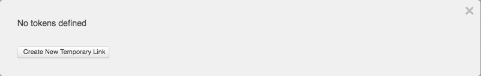

After clicking the "Create New Temporary Link" button, you should see a temporary link:

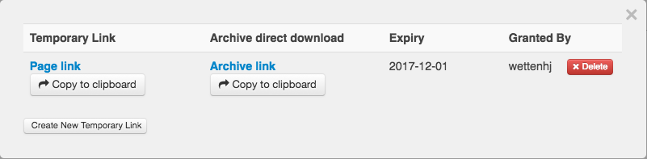

Submitting a Publication for Scheduled Release
==============================================
When you are ready to submit your data publication for release, you can click
the "Submit" button after checking that you have entered all of the required
information, including the date on which the publication should be released.

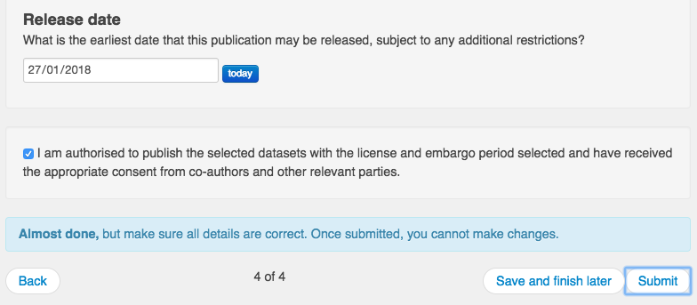

At this point, a DOI (Digital Object Identifier) will be minted and your
publication will be moved from the Drafts section of the My Publications page
to the Scheduled or the Released section, depending on the Release Date you
entered.  In the example below, the Release Date was in the future, so the
publication appears in the Scheduled section.

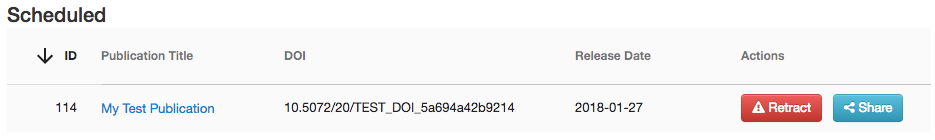

Submitting a Publication for Immediate Release
==============================================
When you are ready to submit your data publication for immediate release, you can
click the "Submit" button after checking that you have entered all of the required
information, including the date on which the publication should be released (today).

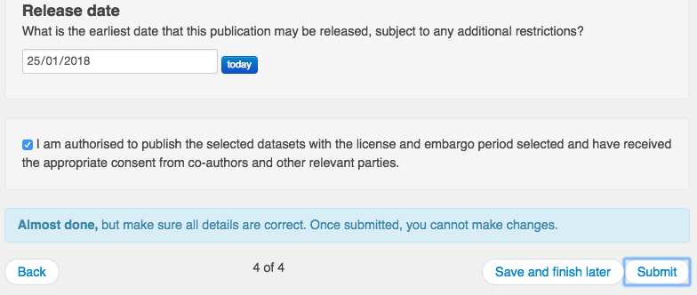

At this point, a DOI (Digital Object Identifier) will be minted and your
publication will be moved from the Drafts section of the My Publications page
to the Scheduled or the Released section, depending on the Release Date you
entered.  In the example below, the Release Date was set to today, so the
publication appears in the Released section.

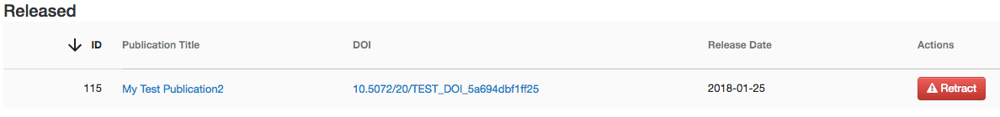

**********************************
For MyTardis System Administrators
**********************************

Enabling or Disabling the Publication Workflow
==============================================
The publication workflow is enabled by default in a new MyTardis installation:

``tardis/default_settings/apps.py:``

.. code-block:: python

  ...
  INSTALLED_APPS = (
      ...
      'tardis.apps.publication_workflow',
      ...
  )

If necessary, it can be disabled in ``tardis/settings.py`` as shown below:

.. code-block:: python

   disabled_apps = ['publication_workflow']
   for app in disabled_apps:
       INSTALLED_APPS = filter(lambda a: a != app, INSTALLED_APPS)

When the publication workflow is enabled, you should see the "My Publications" link in the menu bar:

Publication Workflow Settings
=============================
To use the default publication workflow settings, add the following to your ``tardis/settings.py``:

.. code-block:: python

  from tardis.apps.publication_workflow.default_settings import *

Installing Licenses
===================
The publication workflow app contains Creative Commons licenses in
``tardis/apps/publication_workflow/fixtures/licenses.json`` which
can be installed with:

.. code-block:: python

  python mytardis.py loaddata licenses

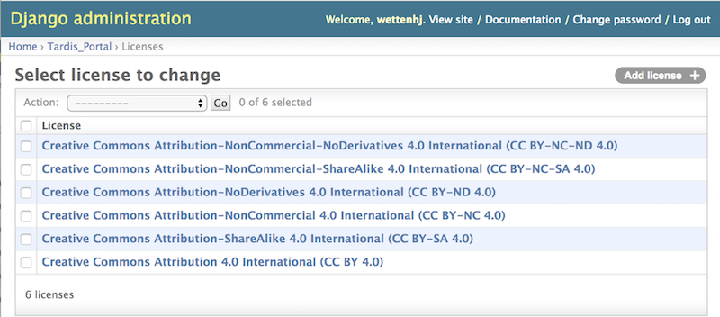

Minting DOIs
============
From Wikipedia, "a Digital Object Identifier or DOI is a persistent identifier
or handle used to uniquely identify objects, standardized by the International
Organization for Standardization".  For example, a DOI of "10.2196/mhealth.3314"
can be resolved at http://dx.doi.org/10.2196/mhealth.3314, leading to
http://mhealth.jmir.org/2014/4/e50/.  DOIs are commonly used to provide permanent
links to published articles, but they can also be used to provide permanent links
to published data.

MyTardis's publication workflow provides functionality for minting DOIs using
Monash University's DOI minting service at https://mod.monash.edu and its
corresponding test service at https://vera186.its.monash.edu/modc/.  DOIs can
be minted manually by MyTardis system administrators, or from the user interface
provided in the "My Publications" view.

To get started, you need to register your MyTardis service as a "Webservice App" in
Monash's DOI-minting service at https://mod.monash.edu or in its corresponding
test service at https://vera186.its.monash.edu/modc/.

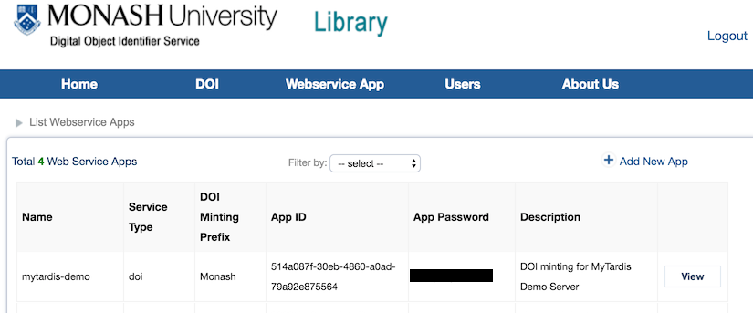

Then you need to configure your MyTardis's tardis/settings.py to use the DOI
minting service.  For the "mytardis-demo" DOI-minting application registered
above on https://vera186.its.monash.edu/modc/, we can use the following
settings:

.. code-block:: python

    MODC_DOI_ENABLED = True
    MODC_DOI_API_ID = '514a087f-30eb-4860-a0ad-79a92e875564'
    # Use the real API password here:
    MODC_DOI_API_PASSWORD = '********'
    MODC_DOI_MINT_DEFINITION = 'https://vera186.its.monash.edu/modc/ws/MintDoiService.wsdl'
    MODC_DOI_ACTIVATE_DEFINITION = 'https://vera186.its.monash.edu/modc/ws/' \
                                   'ActivateDoiService.wsdl'
    MODC_DOI_DEACTIVATE_DEFINITION = 'https://vera186.its.monash.edu/modc/ws/' \
                                     'DeactivateDoiService.wsdl'
    MODC_DOI_ENDPOINT = 'https://vera186.its.monash.edu/modc/ws/'
    # The MODC_DOI_MINT_URL_ROOT should be set to the base URL of your publicly
    # accessible MyTardis server.  You can't test the DOI-minting functionality
    # from a local dev environment (http://127.0.0.1:8000), because the URL you
    # are minting a DOI for needs to be publicly accessible:
    MODC_DOI_MINT_URL_ROOT = 'https://mytardisdemo.erc.monash.edu'

A DOI can be minted from the Django shell (mytardis.py shell_plus) as follows:

.. code-block:: python

    >>> from django.core.urlresolvers import reverse
    >>> from tardis.apps.publication_workflow.doi import DOI
    >>> doi = DOI()
    >>> experiment_id = 105
    >>> doi.mint(experiment_id, reverse('tardis_portal.view_experiment', args=(experiment_id,)))
    10.5072/20/TEST_DOI_5a14bcdd0f309

Now http://dx.doi.org/10.5072/20/TEST_DOI_5a14bcdd0f309 should resolve to
https://mytardisdemo.erc.monash.edu/experiment/view/105/.

We can then deactivate this DOI until the required publication criteria are met:

.. code-block:: python

    >>> doi.deactivate()
    (reply){
       serviceId = "514a087f-30eb-4860-a0ad-79a92e875564"
       responsecode = "MT003"
       message = "DOI 10.5072/20/TEST_DOI_5a14bcdd0f309 was successfully deactivated."
       doi = "10.5072/20/TEST_DOI_5a14bcdd0f309"
       url = None
       verbosemessage = None
     }

If we need to look up the same DOI later, e.g. after exiting the Django shell
and starting a new one, we can create a DOI instance with an existing DOI:

.. code-block:: python

    >>> from tardis.apps.publication_workflow.doi import DOI
    >>> doi = DOI('10.5072/20/TEST_DOI_5a14bcdd0f309')
    >>> doi.activate()
    (reply){
       serviceId = "514a087f-30eb-4860-a0ad-79a92e875564"
       responsecode = "MT004"
       message = "DOI 10.5072/20/TEST_DOI_5a14bcdd0f309 was successfully activated."
       doi = "10.5072/20/TEST_DOI_5a14bcdd0f309"
       url = None
       verbosemessage = None
     }

For a complete list of the possible response codes, see:
https://documentation.ands.org.au/display/DOC/Cite+My+Data+M2M+Service+Responses
