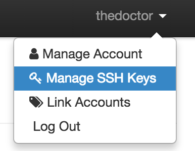
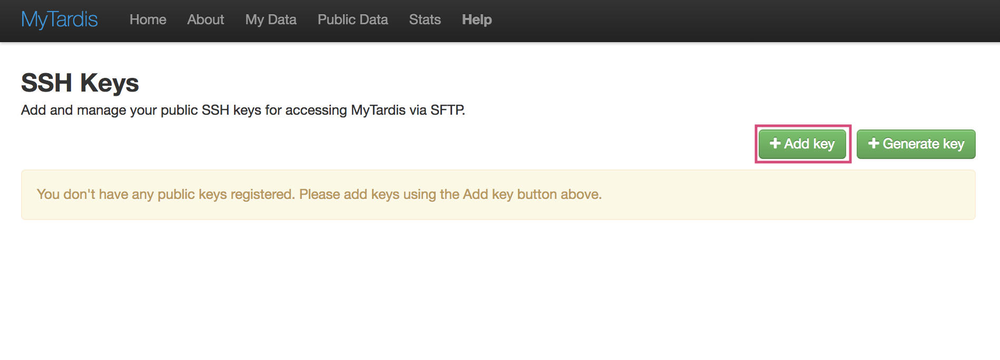
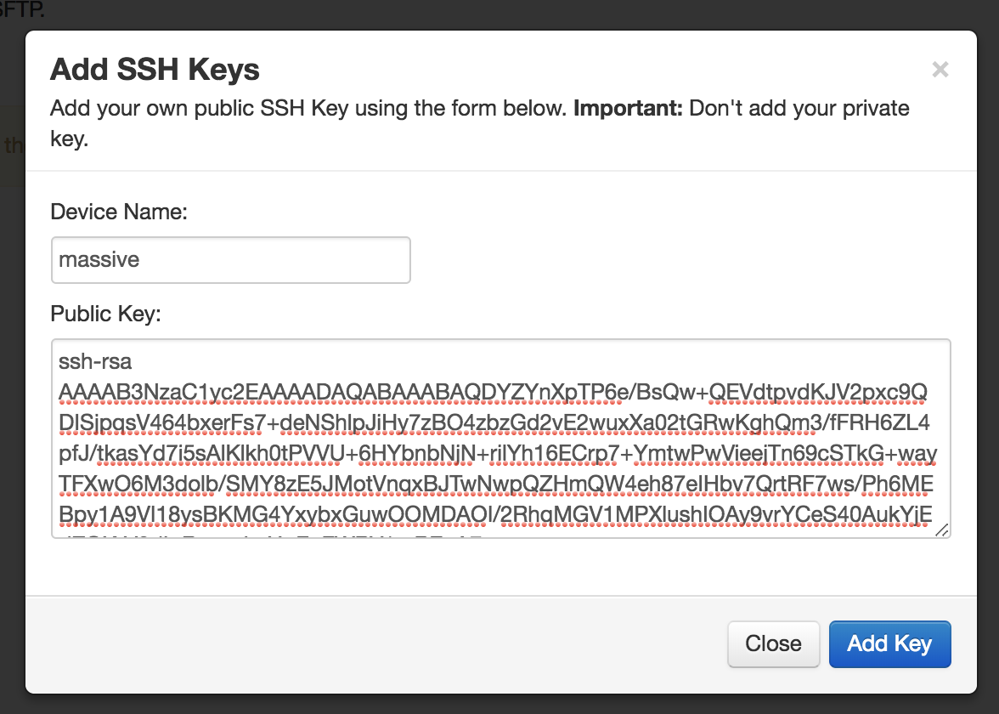
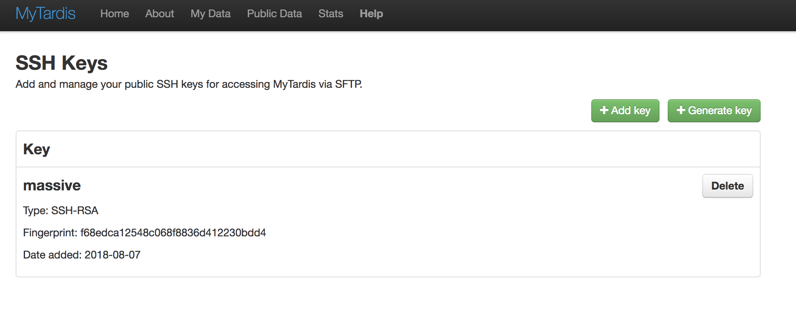
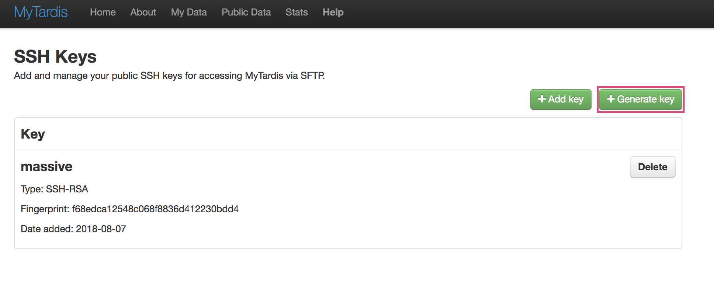
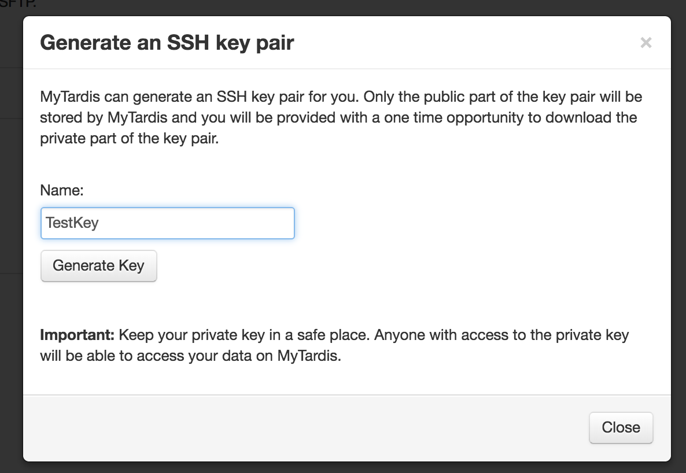
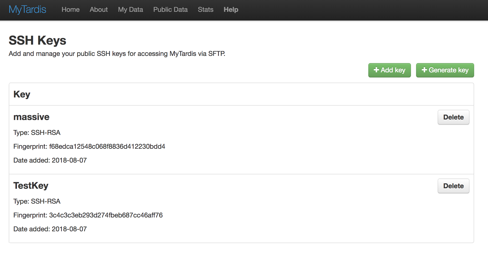
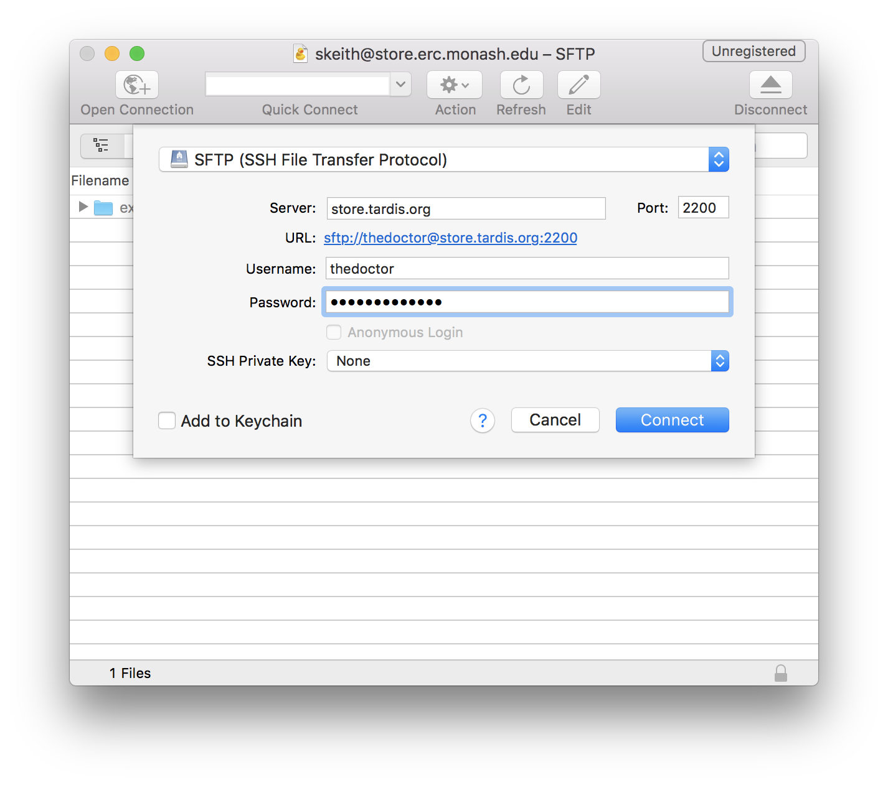
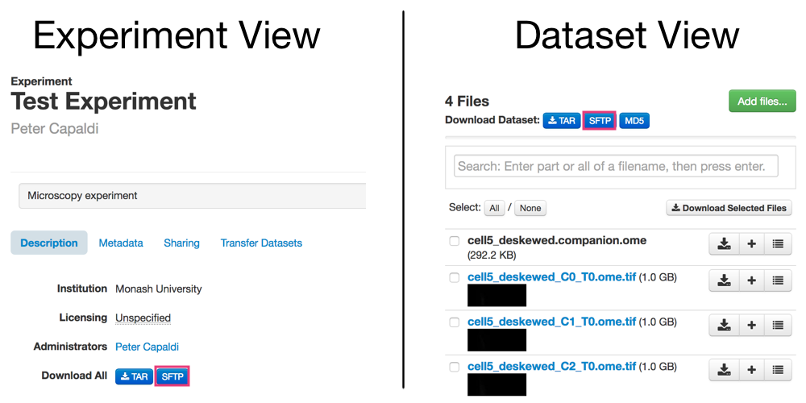

===========
SFTP Access
===========

SFTP is a secure and convenient way to access, browse and download large
Experiments, Datasets and Files in MyTardis. Importantly, the SFTP interface to
MyTardis is read only i.e., it is a mechanism to access data in MyTardis but
does **not** allow adding data to MyTardis.

Prerequisites for accessing data via SFTP
-----------------------------------------

In order to access data on MyTardis via SFTP, you will first need to install an
SFTP client. There are many free and commercial SFTP clients for you to choose
from; however, we recommend `Cyberduck (Win & Mac) <https://cyberduck.io>`_,
`FileZilla (All platforms) <https://filezilla-project.org/>`_ or `WinSCP (Win
only) <https://winscp.net/eng/index.php>`_ for the majority of users. The
instructions here will focus on `Cyberduck (Win & Mac) <https://cyberduck.io>`_.

.. _register-ssh-key:

Registering and managing SSH keys in MyTardis
---------------------------------------------

MyTardis uses SSH key pairs to authenticate you when connecting via SFTP. Using
SSH keys to authenticate is more secure and private than password-based
authentication. SSH keys generally come in a pair: (1) a private part and (2) a
public part. Key-based authentication typically requires you to share your
public key with the service, again which you use your private key to
authenticate. Never share your private key!

MyTardis provide to mechanism for registering a public key:

1. :ref:`add-ssh-key`
2. :ref:`generate-ssh-key`

.. _add-ssh-key:

Adding an existing public SSH key to MyTardis
^^^^^^^^^^^^^^^^^^^^^^^^^^^^^^^^^^^^^^^^^^^^^
If you have an existing SSH keypair, you can register the public key in
MyTardis. For instructions on how to create an SSH key pair, Gitlab provide
some nice documentation on how to do so `here
<https://gitlab.com/help/ssh/README.md#generating-a-new-ssh-key-pair>`_.

To register a public key in MyTardis:

1. Navigate to the SSH key management page using the `Manage SSH Keys` link in
   the user menu.

2. Click the `+ Add Key` button:

3. Fill in the `Add SSH Keys` form by entering a name for the key and the
   public key text. The public key text should be in OpenSSH format e.g., `ssh-rsa
   AAAAB3NzaC1yc2EAAAADAQABAAABAQDYZYnXpTP6e/BsQw+...`.

4. Click the `Add Key` button.

If successful you should get a new entry in the SSH keys table.

.. _generate-ssh-key:

Have MyTardis to generate an SSH key pair
^^^^^^^^^^^^^^^^^^^^^^^^^^^^^^^^^^^^^^^^^

Creating SSH key pairs can be a bit of a challenge, particularly on Windows
systems. For this reason, MyTardis provides another you another option for
registering a public keys. In this case, MyTardis will generate the key pair
for you, store the public part of the key and provide you with a one time
opportunity to download the private part of the key.

It is important to note that MyTardis never stores your private key. If you
lose/delete it, MyTardis cannot recover it for you. This isn't really a
problem, since MyTardis can always generate another key pair for you; however,
you should revoke the public key associated to the lost private key in your
account to ensure that no one who gains access to your private key can access
your data. See :ref:`delete-ssh-key`.

1. Navigate to the SSH key management page using the `Manage SSH Keys` link in
   the user menu.

2. Click the `+ Generate key` button:

3. Give the key a name and click the `Generate & Download` button. The server
   will generate an SSH key pair, register the public key and trigger your
   browser to download the private key.

4. The SSH keys table will be updated with your newly registered public key.

.. _delete-ssh-key:

Deleting previously registered public keys in MyTardis
^^^^^^^^^^^^^^^^^^^^^^^^^^^^^^^^^^^^^^^^^^^^^^^^^^^^^^
Removing a previously registered public SSH key from MyTardis is
straightforward.

1. Navigate to the SSH key management page using the `Manage SSH Keys` link in
   the user menu.

2. Click the `Delete` button on the key you wish to remove.

.. image:: ../images/userguide/delete_ssh_key.png

Attempting to connect to MyTardis via SFTP using the private sister key to the
deleted key will no longer work.

Connecting to MyTardis via SFTP
-------------------------------
1. Open your SFTP client and create a new connection with the following
   configuration:

  +-------------+-----------------------------------------+
  | Parameter   | Value                                   |
  +=============+=========================================+
  | Server:     | *URL for your MyTardis deployment*      |
  |             | e.g. `<https://store.erc.monash.edu>`_  |
  +-------------+-----------------------------------------+
  | Port:       | *Port on which SFTP server is running*  |
  +-------------+-----------------------------------------+
  | Username:   | *Your MyTardis username*                |
  +-------------+-----------------------------------------+
  | Password:   | *Leave this blank*                      |
  +-------------+-----------------------------------------+
  | SSH Private | *Path to a private SSH key* [1]_        |
  | Key         |                                         |
  +-------------+-----------------------------------------+

  **Note:** substitute your credentials and details for your MyTardis
  deployment for the *italicised* values. If you are unsure about any of these
  value, please contact your system admin should be able to provide these to
  you.

2. Click **Connect**
3. Upon successful connection you will be presented with a file browser showing
   all your data on MyTardis.

Data is organised according to the Experiment/Dataset/Data File
hierarchy/structure described in the :ref:`org_data` section.

.. [1] You must register the public key in MyTardis first, see
       :ref:`register-ssh-key`

Browse and/or Download a Specific Experiment or Dataset
-------------------------------------------------------
MyTardis also provides a convenient way to access/browse a particular
Experiment or Dataset via SFTP.

1. Navigate to the Experiment or Dataset page that you want to access via SFTP
   using your web browser.
#. There is an **SFTP** button in the *Download* section on both the Experiment
   and Dataset views.

3. Clicking the **SFTP** button at either of these two locations will redirect
   you to a page with instructions and links for starting an SFTP session for a
   specific experiment or dataset.
